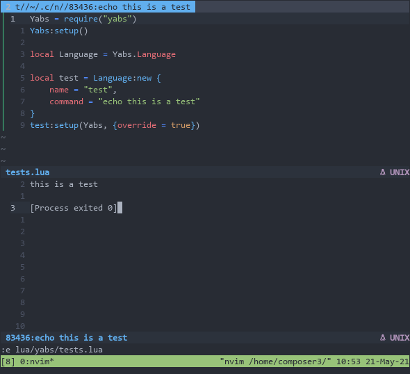

# yabs.nvim

Yet Another Build System for Neovim, written in lua



## About

At its heart, yabs.nvim is just a mapping of languages/filetypes to the command that will build and/or run them. You provide a string (or a function - more on that later) designating what command to run as well as a function that takes that string as an argument. Any time you run `Yabs:build()`, the plugin will pass the command for the current filetype to the build function.

## Usage

### The list of build commands
The main way you interact with the plugin is with the `Yabs` object, which is returned when you `require("yabs")`. You call `Yabs:setup` with a list of languages and their build commands. The build command be either a string or a function that returns either a string or `nil`.

```lua
Yabs = require("yabs")

Yabs:setup {
    languages = {
        lua = function()
            vim.cmd("luafile %")
        end,
        python = function()
            local file = vim.fn.expand("%:~:.")
            return "python3 " .. file
        end
    }
}
```

As seen above, you simply provide the name of the language (in vim filetype format) as the key, and the function that should be called on `Yabs:build()` as the value.

### Default and override build commands
You can also provide one of two aditional arguments - `default` and `override` - by supplying a table instead of a function, like so:

```lua
Yabs:setup {
    languages = {
        default = {
            function() print("default") end,
            default = true
        },
        override = {
            function() print("override") end,
            override = true
        }
    }
}
```

Languages marked as default or override are not matched to a filetype like normal. Instead, the default build command will be run for any filetype that is not in the list, and the override build command is run no matter the filetype, even if it has one specified. Providing an `override` build command makes all other build commands irrelevant, so this is generally only useful for project-local configurations (see the next section about the ".yabs" file).

### The `build_func`
This optional argument determines what should be done with the command supplied for the current filetype when `Yabs:build()` is called. It takes one argument, the command to run (as a string). The default is to run the command as a shell command using vim's `:![cmd]` syntax.

## The ".yabs" file
Yabs.vim will look for a file called ".yabs" in the root of your project once per neovim session the first time you run `Yabs:build()`. If it is found, it will be sourced as a lua file. This can be used for per-project configuration.

## Examples

### Run using !cmd syntax
```lua
Yabs = require("yabs")
Yabs:setup {
    build_func = function(cmd) vim.cmd("!" .. cmd) end,
    languages = {
        python = function()
            -- Returns "python3" plus the name of the current file
            local file = vim.fn.expand("%:~:.")
            return "python3 " .. file
        end,
        lua = {
            function()
                -- This function doesn't return anything, so no shell commands will be run
                vim.cmd("luafile %")
            end,
            default = true
        }
    }
}
```

### Run using [consolation.nvim](https://github.com/pianocomposer321/consolation.nvim)
```lua
local Wrapper = require("consolation").Wrapper

TerminalWrapper = Wrapper:new()
TerminalWrapper:setup {
    -- snip
}

Yabs = require("yabs")
Yabs:setup {
    build_func = functino(cmd)
        TerminalWrapper:send_command {cmd = cmd}
    end,
    -- snip: rest is same as above
}
```
