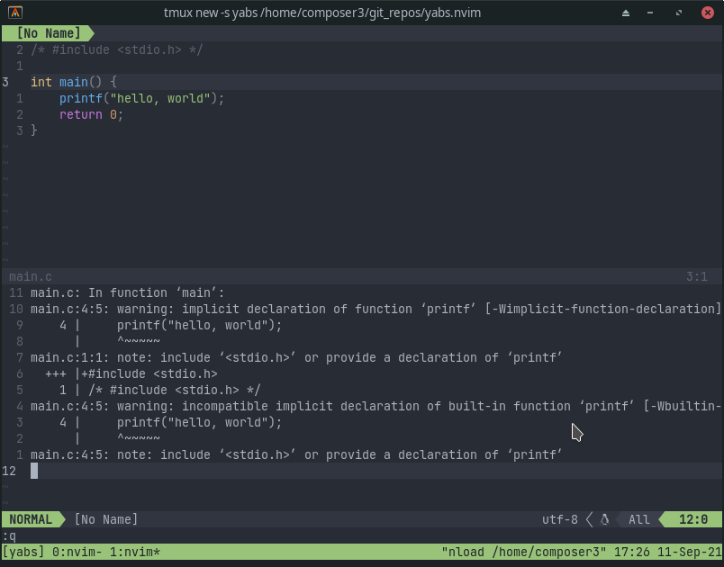
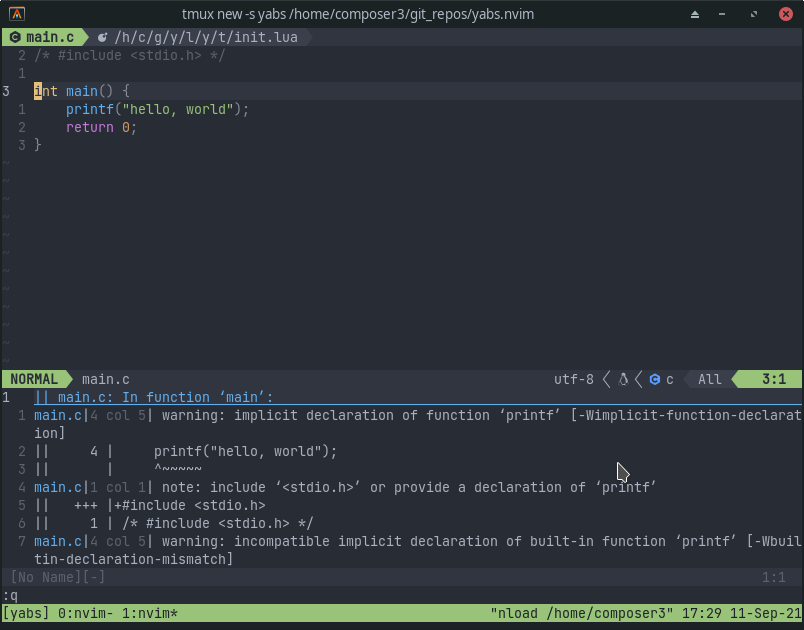

# yabs.nvim

Yet Another Build System for Neovim, written in lua.

<!--  -->

## About

At its heart, yabs.nvim is just a mapping of languages/filetypes to the command that will build and/or run them. You provide a string (or a function - more on that later) designating what command to run as well as a function that takes that string as an argument. Any time you run `require("yabs"):build()`, the plugin will pass the command for the current filetype to the build function.

## Installation
Packer.nvim:

`use 'pianocomposer321/yabs.nvim'`

vim-plug:

`Plug 'pianocomposer321/yabs.nvim'`

etc.

## Setup

```lua
require("yabs"):setup {
    languages = {  -- List of languages in vim `filetype` format
        lua = {
            command = "luafile %",  -- The cammand to run (% and other
                                    -- wildcards will be automatically expanded)
            type = "vim",  -- The type of command (can be `vim` or `shell`, default `shell`)
            default = true  -- If true, this is the command that will be run
                            -- for filetypes not listed in yabs.languages
        },
        c = {
            command = "gcc main.c -o main",
            output = "quickfix",  -- Where to show output of the command
                                  -- can be `buffer`, `consolation`, `echo`,
                                  -- `quickfix`, `terminal`, or `none`
            opts = {  -- Options for output (currently, the only one is `open_on_run`, which
                      -- defines the behavior for the quickfix list opening)
                      -- (can be `never`, `always`, or `auto`, the default)
                open_on_run = "always"
            }
        },
        override = {  -- If override is true, all other language settings will
                      -- be ignored and the override language's command will
                      -- always be run.
                      -- This is usually only useful in a .yabs file (see below)
            command = "echo 'this command will always be run'",
            type = "vim",
            override = true
        }
    },
    output_types = {  -- Same values as `language.opts`, but global
        quickfix = {
            open_on_run = "auto"
        }
    }
}
```

## Usage

```lua
require("yabs"):build()  -- Runs the command specified by the `command` option
                         -- for the current filetype in `yabs:setup()`
```

### ".yabs" files

The first time you run `yabs:build()`, yabs will look for a file named .yabs in
the current working directory. If found, it will be sourced as a lua file. This
is useful for project-local configurations.

## Telescope integration

You can execute tasks from Telescope by running `:Telescope yabs tasks` / `:Telescope yabs current_language_tasks` or `:Telescope yabs global_tasks`.

## Advanced configuration

The language.command option in `yabs:setup()` can be a string or a function that returns a string. Specifying a function instead can be useful for more advanced commands.

Likewise, the langauge.output option can be one of the included types (`buffer`, `consolation`, `echo`, `quickfix`, `terminal`, or `none`), or a function accepting one argumet - the command to run. For example, if you are using tmux, you could write a function to send the command to a tmux pane.

## Screenshots

<details>
<summary>Buffer</summary>


</details>

<details>
<summary>Echo</summary>


</details>

<details>
<summary>Quickfix</summary>


</details>

<details>
<summary>Terminal</summary>


</details>
<!--  -->
